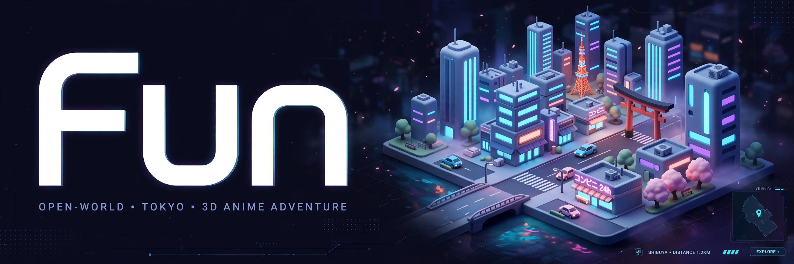

# Fun

> ## Status: 🟡 In Progress
>
> <progress value="80" max="100"></progress>
> **Progress: 80%** — Phase 1's 11 milestones (seeded city, player, NPC crowd, day/night, polish) are built and verified; Phases 2–3 (real NPC paths, back-and-forth conversations, weather) are spec'd in `PHASE2_PROMPT.md` / `PHASE3_PROMPT.md` but not yet built.

<p align="center">
  
</p>

## What it is

A cozy open-world 3D town you walk around in, built with **Three.js + Vite + plain JavaScript** — no game engine, no frameworks. Wander brick streets along a canal, chat with townsfolk (press **E**), sit on a park bench, swim out to the harbour, and watch the lampposts flicker on as night falls. The ~300×300 m town is generated from a seeded layout, so it's the same on every visit. It also ships two bonus pages: a city asset viewer (`viewer.html`) and a character viewer (`chars.html`).

## What works (verified)

- ✅ `npm install` — tested, 17 packages in ~6s
- ✅ `npm run dev` — tested, serves `index.html`, `viewer.html`, `chars.html` on `http://127.0.0.1:5173/` (all return HTTP 200)
- ✅ `npm run build` — tested, production build succeeds in ~3.5s (27 modules transformed)
- ✅ `node --test src/city/layout.test.js` — tested, **8/8 pass** (seed determinism, block census, prop placement)
- ✅ Third-person player — WASD/arrows move, Shift sprint, Space jump, pointer-lock mouse look, scroll zoom (`src/player/`)
- ✅ 36 NPC townsfolk — waypoint-graph wandering, sitting, chatting in pairs, dancing, greetings, look-at-player (`src/npc/`)
- ✅ E-to-talk interactions with speech bubbles (`src/npc/interact.js`)
- ✅ 10-minute day/night cycle, lamppost lights, torch watchmen (`src/fx/`)
- ✅ Swimming, minimap, procedural footsteps + ambient audio (`src/player/swim.js`, `src/fx/`)
- ✅ Headless Playwright verification suites exist (`tools/verify_*.mjs`) — not run here (no browser/WebGL in this environment)
- ✅ No TODOs/FIXMEs in project code (the only 2 matches are inside third-party asset license files); no CI configured


## Tech stack

| Layer | Tech |
|---|---|
| 3D | Three.js 0.180 (ES modules, `three/addons`) |
| Build / dev | Vite 7 |
| Language | Plain JavaScript, no frameworks |
| Tests | Node's built-in test runner (`node --test`) |
| Verification | Playwright headless suites (`tools/verify_*.mjs`) |
| Assets | Quaternius packs + Kenney CC0 kits (see `assets_free/CREDITS.md`), city kit converted from Collada via headless Blender |

## How to run

```bash
npm install
npm run dev     # → http://127.0.0.1:5173/
```

Other useful commands (all tested except the Playwright suites):

```bash
npm run build                      # production build → dist/
node --test src/city/layout.test.js  # 8/8 pass
node tools/verify_player.mjs       # needs Playwright + browser (not run here)
node tools/verify_crowd.mjs
node tools/verify_interact.mjs
node tools/verify_polish.mjs
```

**Controls:** WASD/arrows = move · Shift = sprint · Space = jump / climb out of water · E = talk · M = mute · click = mouse look · scroll = zoom.

Note: `npm run build` currently emits only `index.html` — `viewer.html` and `chars.html` are served by the dev server but aren't wired into the production build.

## Screenshots

All from `docs/screenshots/` (checked into the repo):

| Canal & bridges | Harbour swim |
|---|---|
|  |  |

| Townsfolk | Night |
|---|---|
|  |  |

| Taking a breather | Saying hello |
|---|---|
|  |  |

## The people

36 townsfolk with real variety — mixed-and-matched outfits, palettes, hairstyles and beards over a shared 65-bone skeleton, all animated from one shared clip library. They wander the sidewalks, sit on benches, stop to chat in pairs, dance on the church plaza, greet you as you pass, and turn their heads to look at you. Walk up to anyone and press **E** — they'll stop, face you, and say hello in a speech bubble (a seated NPC will even stand up first).

## Day & night

Time flows on a 10-minute day cycle. The sun arcs across the sky, dusk paints the town orange, and at night the lampposts glow with warm pools of light while torch-bearing watchmen take their posts. At dawn everyone goes back to their day.

## What you can add more

From `PHASE2_PROMPT.md` / `PHASE3_PROMPT.md` (the planned next phases):

- [ ] Real NPC paths with visible destinations — currently NPCs drift without fixed routes (Phase 3 complaint #1)
- [ ] Back-and-forth NPC conversations — E currently shows one line; make it NPC speaks → you reply → NPC answers → goodbye (Phase 3 complaint #2)
- [ ] Weather system — rain/clear cycles affecting light and NPC behavior (Phase 3)
- [ ] Boats and water traffic on the canal/harbour (Phase 2)
- [ ] Wire `viewer.html` / `chars.html` into the production build (`rollupOptions.input`) — dev-only today
- [ ] CI: run `node --test` + `npm run build` on every push (no Actions workflow yet)

## Project structure

```
Fun/
├── index.html          # the game
├── viewer.html         # city asset viewer (dev server)
├── chars.html          # character viewer (dev server)
├── src/
│   ├── main.js         # game bootstrap + main loop
│   ├── viewer.js       # asset viewer logic
│   ├── chars.js        # character viewer logic
│   ├── city/           # layout.js (seeded town plan), build.js, colliders.js
│   ├── player/         # player.js (third-person controller), swim.js
│   ├── npc/            # npc.js (character factory), crowd.js, graph.js,
│   │                   # behavior.js (sit/chat/dance/greet), interact.js,
│   │                   # torch.js (night watchmen)
│   ├── fx/             # daynight.js, lamps.js, audio.js, minimap.js
│   └── assets.js       # shared GLB/texture cache
├── tools/              # asset pipeline (Blender/Unity → GLB) + Playwright verify suites
├── docs/screenshots/   # the pictures above
├── public/assets/      # city + character models and textures
├── MASTER_PROMPT.md    # Phase 1 build spec (features 1–11)
├── PHASE2_PROMPT.md    # Phase 2 spec (liveliness, water traffic)
└── PHASE3_PROMPT.md    # Phase 3 spec (NPC paths, conversations, weather)
```

## Tech notes

- Repeated props are `InstancedMesh`; houses are merged per palette — the whole town renders in roughly a hundred draw calls.
- One shared `AnimationClip` library; NPC mixers update fully under 40 m, every 3rd frame to 80 m, hidden beyond that.
- A single 2048px shadow-casting directional light; pixel ratio capped at 2.

## Credits

- City models: Low Poly Bricks City kit · Vegetation kit
- Characters: modular fantasy character pack, animations from the UAL1_Standard library
- Free assets: all CC0 1.0 by Kenney — full list in `assets_free/CREDITS.md`

---
*README written after code audit on 2026-10-08.*
