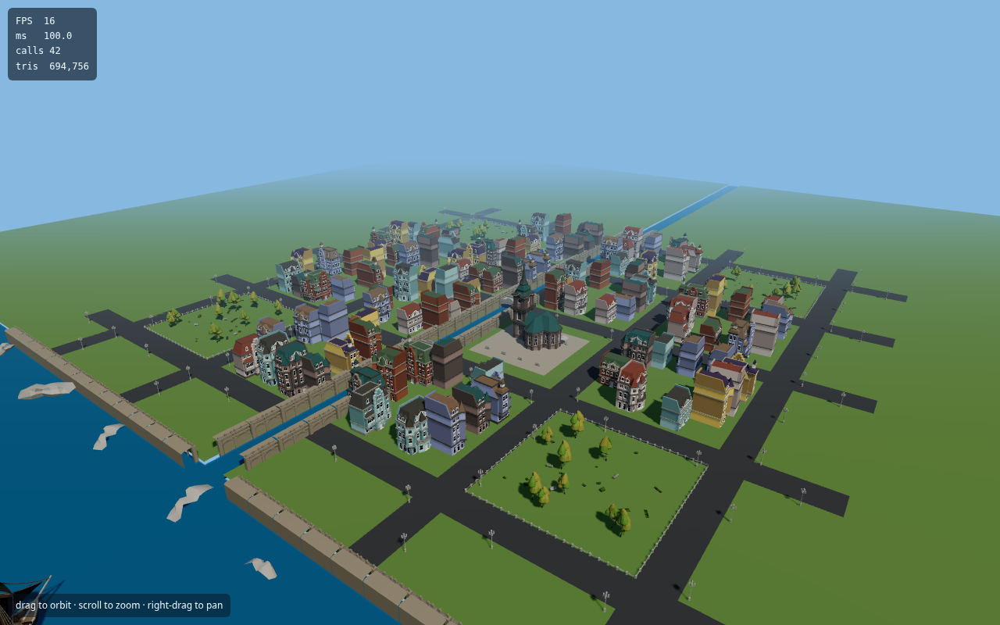
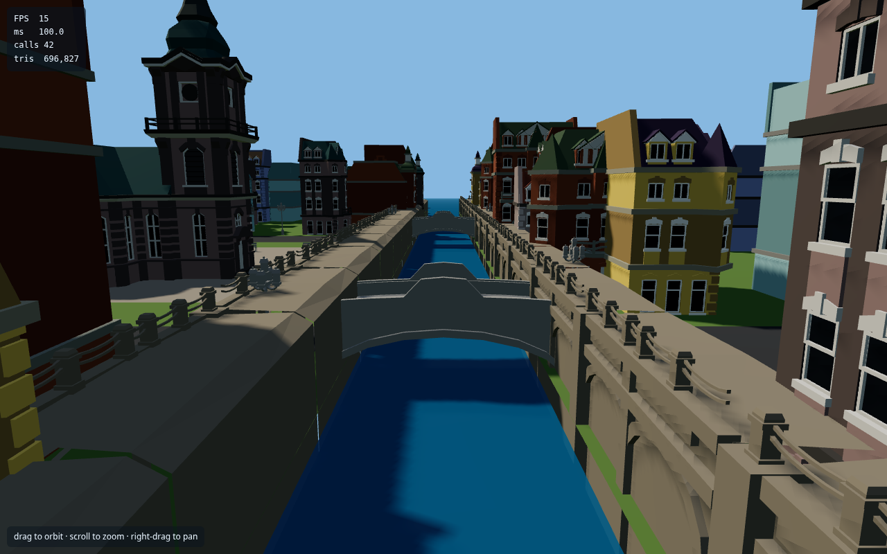
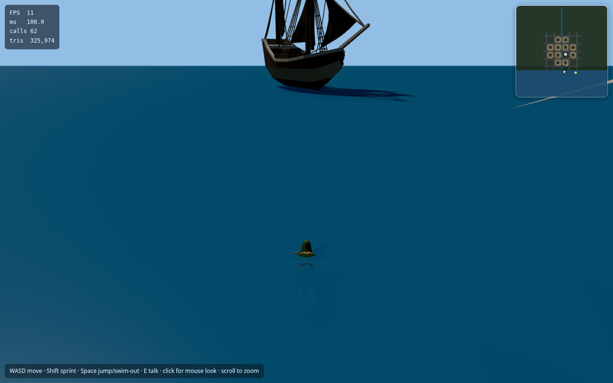
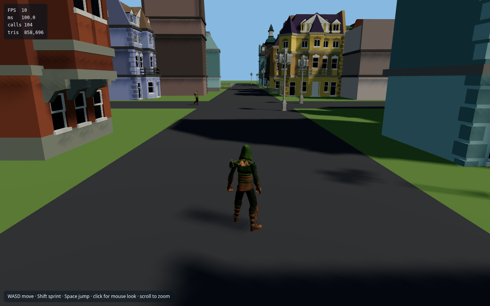
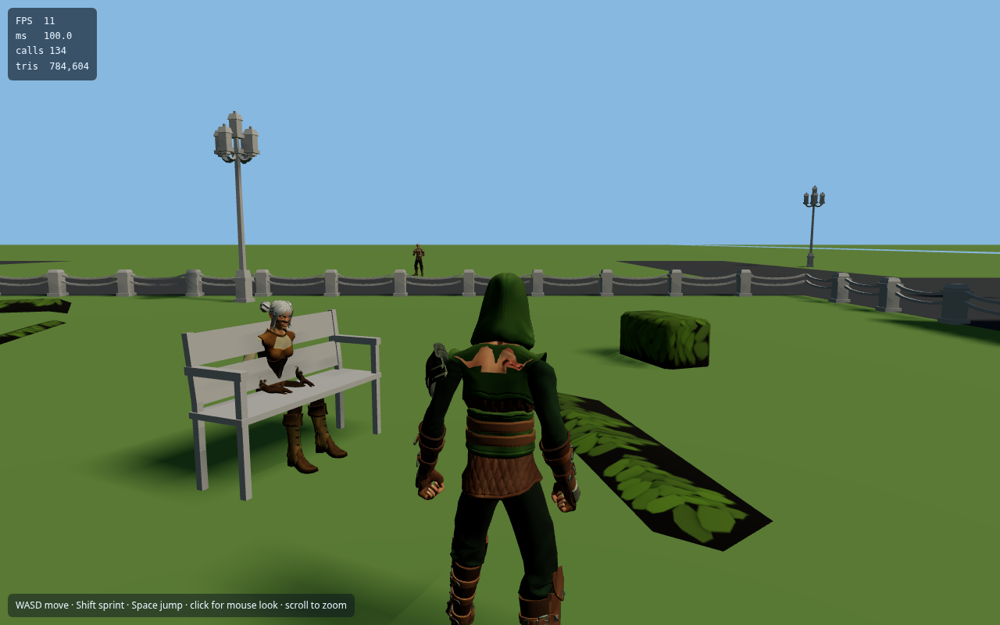
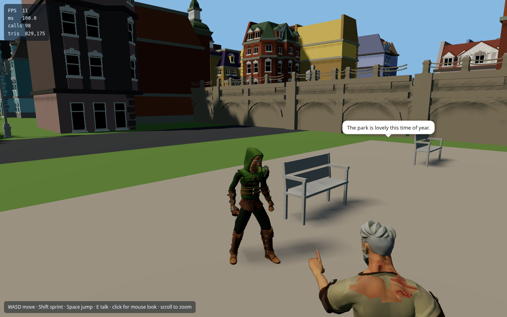
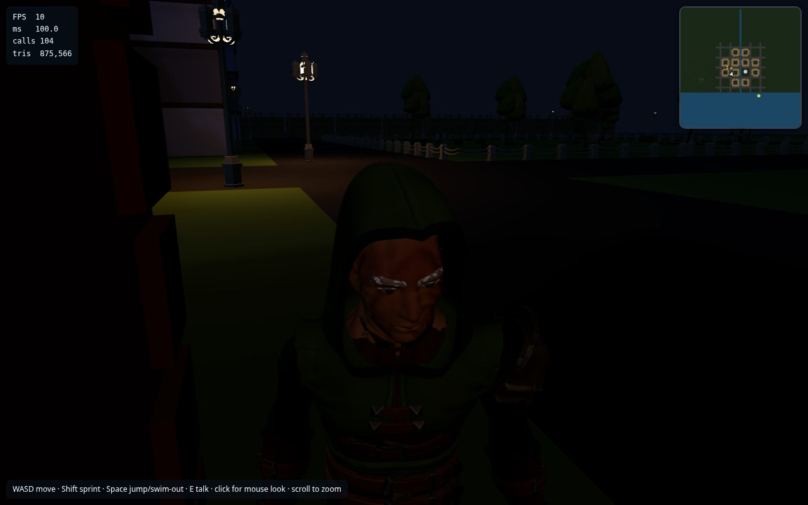

# Fun — Open-World Low-Poly City

A cozy little open-world town you can walk around in. Wander brick streets
along a canal, chat with townsfolk, sit on a park bench, swim out to the
harbour, and watch the lampposts flicker on as night falls.

Built with **Three.js + Vite + plain JavaScript** — no game engine, no
frameworks.



## The city

A ~300×300 m hand-seeded town: brick houses, a church plaza, parks, a
north–south canal with three arched bridges, and a harbour with a lighthouse
and a ship. Everything is generated from a seeded layout, so the town is the
same on every visit.

| Canal & bridges | Harbour |
|---|---|
|  |  |

## The people

36 townsfolk with real variety — mixed-and-matched outfits, palettes,
hairstyles and beards over a shared 65-bone skeleton, all animated from one
shared clip library. They wander the sidewalks, sit on benches, stop to chat
in pairs, dance on the church plaza, greet you as you pass, and turn their
heads to look at you.



Walk up to anyone and press **E** — they'll stop, face you, and say hello in
a speech bubble. (A seated NPC will even stand up first.)

| Taking a breather | Saying hello |
|---|---|
|  |  |

## Day & night

Time flows on a 10-minute day cycle. The sun arcs across the sky, dusk paints
the town orange, and at night the lampposts glow with warm pools of light
while torch-bearing watchmen take their posts. At dawn everyone goes back to
their day.



## Controls

| Key | Action |
|---|---|
| **WASD / arrows** | Move |
| **Shift** | Sprint |
| **Space** | Jump · climb out of water while swimming |
| **E** | Talk to a nearby NPC |
| **M** | Mute / unmute audio |
| **Click** | Mouse look (pointer lock) |
| **Scroll** | Zoom camera |

There's also a live minimap in the top-right corner showing the town, the
water, nearby townsfolk, and which way you're facing.

## Features

All eleven milestones from the build spec are in:

1. **Scene skeleton** — renderer, camera, lights, ground
2. **Asset pipeline** — GLB loading, palette textures, model viewer
3. **City & landscape** — seeded town generator, canal, harbour
4. **Character pipeline** — modular mix-and-match townsfolk
5. **Player** — third-person ranger with mouse-look camera
6. **Collisions** — capsule vs buildings/props, wall sliding, gravity
7. **Player animation** — idle/walk/jog/sprint hysteresis, jump sequence
8. **NPC crowd** — sidewalk graph, 36 walkers, distance LOD
9. **NPC behavior** — sit, chat, dance, greet, look-at-player
10. **Interaction** — E to talk, speech bubbles
11. **Polish** — day/night cycle, lamppost lights, torch NPCs, swimming,
   procedural footsteps & ambient audio, minimap

## Run it

```bash
npm install
npm run dev     # → http://127.0.0.1:5173/
```

Other useful commands:

```bash
npm run build   # production build
node tools/verify_player.mjs    # headless browser test suites
node tools/verify_crowd.mjs
node tools/verify_interact.mjs
node tools/verify_polish.mjs
```

## Project structure

```
src/
  main.js            game bootstrap + main loop
  city/              layout.js (seeded town plan), build.js, colliders.js
  player/            player.js (third-person controller), swim.js
  npc/               npc.js (character factory), crowd.js, graph.js,
                     behavior.js (sit/chat/dance/greet), interact.js,
                     torch.js (night watchmen)
  fx/                daynight.js, lamps.js, audio.js, minimap.js
  assets.js          shared GLB/texture cache
tools/               headless Playwright verification suites
docs/screenshots/    the pictures above
public/assets/       city + character models and textures
```

## Tech notes

- Repeated props are `InstancedMesh`; houses are merged per palette —
  the whole town renders in roughly a hundred draw calls.
- One shared `AnimationClip` library; NPC mixers update fully under 40 m,
  every 3rd frame to 80 m, and are hidden beyond that.
- A single 2048px shadow-casting directional light; pixel ratio capped at 2.

## Credits

- City models: Low Poly Bricks City kit · Vegetation kit
- Characters: modular fantasy character pack, animations from the
  UAL1_Standard library
